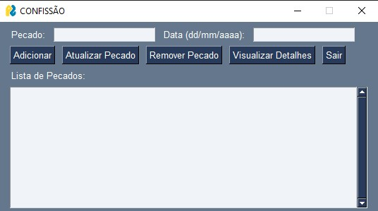

# 🙏 CONFISSÃO - Rastreador de Pecados

    

**Status:** ✅ Concluído  

O **CONFISSÃO** é um aplicativo desenvolvido em **Python** utilizando `PySimpleGUI`, projetado para ajudar os usuários a rastrear seus pecados e manter um histórico de progresso espiritual.

## 🔧 Tecnologias Utilizadas

- **Python 3**  
- **PySimpleGUI** para a interface gráfica  
- **JSON** para armazenamento de dados  

## 📌 Funcionalidades

✔️ **Cadastro de Usuário** com senha criptografada  
✔️ **Login Seguro** com hash de senha  
✔️ **Registro de Pecados** com datas específicas  
✔️ **Cálculo de Dias sem Pecar**  
✔️ **Histórico de Progressão Espiritual**  
✔️ **Atualização e Remoção de Pecados**  

## 📥 Como Usar

1️⃣ Instale as dependências com:
    pip install PySimpleGUI

2️⃣ Execute o programa:
    python confissao.py
